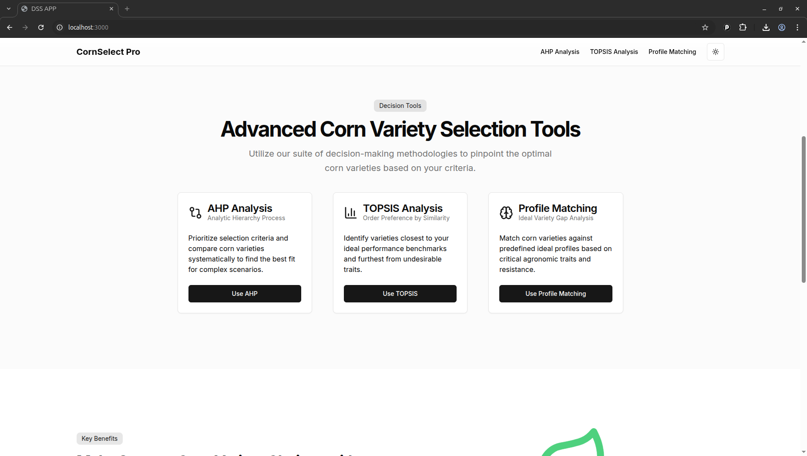
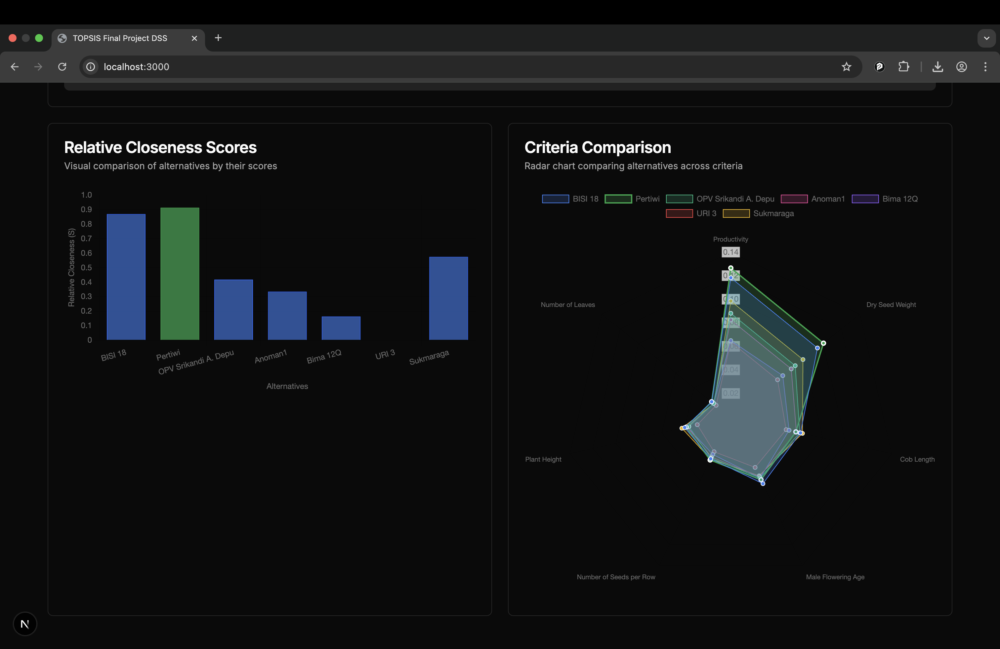

<div align="center">
  
  <h1>Corn Variety Decision Support System</h1>
  <p>An intelligent web application to help you select the perfect corn variety using data-driven insights.</p>
  
  <p>
    
    
    
    
  </p>
</div>

---

## 📖 Table of Contents

- [About The Project](#about-the-project)
- [Key Features](#key-features)
- [Screenshots](#screenshots)
- [Tech Stack](#tech-stack)
- [Getting Started](#getting-started)
  - [Prerequisites](#prerequisites)
  - [Installation & Setup](#installation--setup)
- [Team Member](#team-member)

---

## About The Project

The **Corn Variety Decision Support System** is a sophisticated web application designed to simplify the complex process of selecting the most suitable corn varieties. Built as a final project for SPKC, this tool empowers agricultural decision-makers by providing a user-friendly interface to filter, compare, and analyze corn varieties based on a wide range of critical criteria. By leveraging comprehensive data, the system removes guesswork and facilitates an informed, strategic selection process.

---

## Key Features

- **Advanced Filtering:** Narrow down options based on criteria like yield potential, climate resilience, soil type, and more.
- **Side-by-Side Comparison:** Analyze the pros and cons of different corn varieties in an intuitive comparison view.
- **Data-Driven Recommendations:** Receive intelligent suggestions based on your specific inputs and requirements.
- **Responsive Design:** Access the system seamlessly on any device, whether you're in the office or out in the field.
- **User-Friendly Interface:** A clean and modern UI built with Shadcn UI for an effortless user experience.

---

## Screenshots

Here's a sneak peek of the application in action.

<div align="center">
  
  
</div>

---

## Tech Stack

This project is built with a modern and powerful set of technologies:

| Technology | Description |
| :--- | :--- |
| **[Next.js](https://nextjs.org/)** | A leading React framework for building fast and scalable web applications. |
| **[React](https://react.dev/)** | The core library for building user interfaces. |
| **[TypeScript](https://www.typescriptlang.org/)** | For robust, type-safe JavaScript code. |
| **[Shadcn UI](https://ui.shadcn.com/)** | A collection of beautifully designed, reusable components. |
| **[Tailwind CSS](https://tailwindcss.com/)** | A utility-first CSS framework for rapid UI development. |
| **[pnpm](https://pnpm.io/)** | A fast, disk space-efficient package manager. |

---

## Getting Started

Follow these steps to get a local copy of the project up and running.

### Prerequisites

Before you begin, ensure you have the following installed on your machine:
- [Node.js](https://nodejs.org/) (v18.x or newer is recommended)
- [Git](https://git-scm.com/) for version control

You will also need a package manager. We recommend **pnpm** for its performance and efficiency.

- **pnpm**

- **Bun**

- **npm:**
Comes pre-installed with Node.js.
---

### Installation & Setup

Follow these steps to get your development environment running.

1. Clone the RepositoryFirst, clone the project from GitHub to your local machine.
    ```bash
    git clone https://github.com/sakspari/final-project-spkc.git
    cd final-project-spkc
    ```
2. Install Project DependenciesChoose your preferred package manager and run one of the following commands in the project's root directory.Note: pnpm is the recommended choice for this project.

    **Using pnpm (Recommended)**
        
        pnpm install
        
    **Using npm**

        npm install

    **Using Bun**
    
        bun install

3. Build the Project for Production before running the application, it's best practice to create a production-ready build. This optimizes the code for performance.

    **Using pnpm**

        pnpm build

    **Using npm**

        npm run build

    **Using Bun**

        bun run build

4. Start the Server once the build is complete, you can start the local production server.

    **Using pnpm**

        pnpm start

    **Using npm**

        npm run start

    **Using Bun**

        bun run start

### 🎉 Congratulations! The application should now be running on http://localhost:3000.

### Development Mode: 
If you plan to actively develop and want features like hot-reloading, you can run pnpm dev, npm run dev, or bun dev instead of the build and start commands.

## Team Member

This project was developed by a dedicated team.

- [Frederik Baptista Sakspari]
- [Rafli Irfansyah Kusumawardhana]
- [Bintang Muhammad Madani]